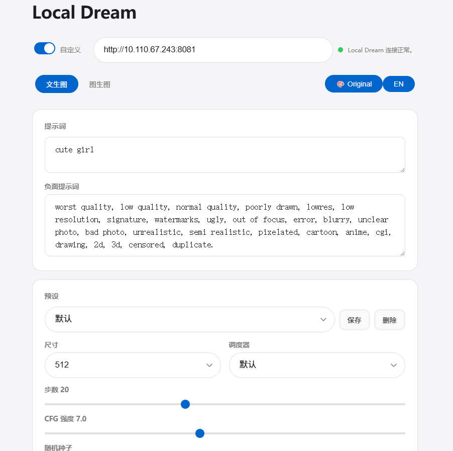
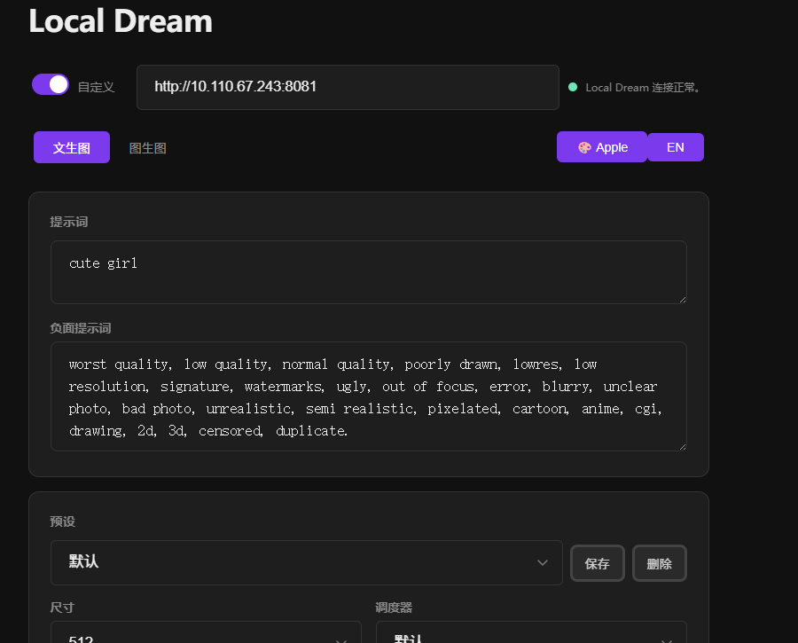
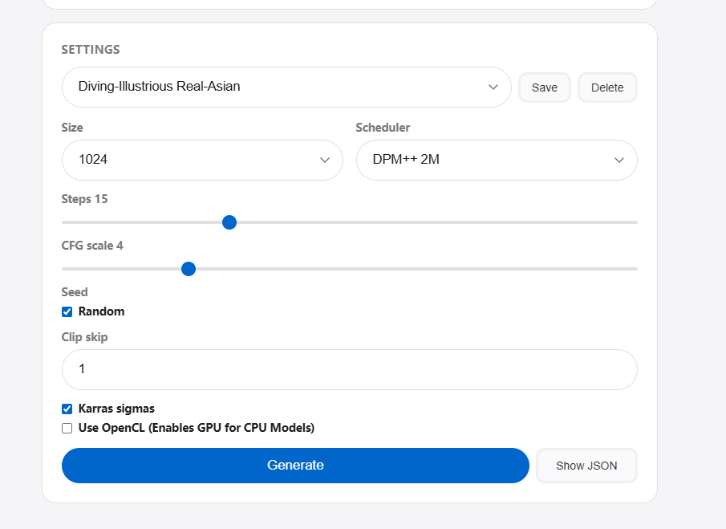

# Local Dream WebUI

A Flask web UI for the [Local Dream](https://github.com/xororz/local-dream) Android app's local HTTP API. [中文](README_zh.md)

## Features

- **txt2img** — generate images from a text prompt
- **img2img** — generate from an input image + prompt
- **Inpainting** — draw a mask over the input image to repaint specific areas
- **Automask** — one-tap clothing/body segmentation via HuggingFace; select segments to build a mask automatically
- **Full-res inpaint composite** — generated content is composited back onto the original image at its original resolution, not the 512px crop
- **Crop/position modal** — drag and pinch-zoom your image to fit the generation canvas; empty areas are automatically outpainted
- **Real-time progress** — SSE streaming shows step-by-step generation progress
- **Size options** — 256, 384, 512, 640, 768, 1024, or custom (up to 2048)
- **Details panel** — shows Steps, CFG, Size, Seed, Scheduler, and generation time after each run
- **Session persistence** — uploaded image, mask, and crop region survive page reloads (cleared when tab closes)
- **Multi-language** — English and Chinese UI, toggle in the top nav bar
- **Parameter presets** — save and load prompt, negative prompt, size, steps, scheduler, CFG, and Karras settings
- **Configurable backend** — set a custom Local Dream IP/port when running on different machines
- **Real-time connectivity** — health check auto-runs on URL changes; instant feedback on backend status
- **Theme system** — switch between Apple-inspired light theme and original dark purple theme via the nav bar button
- **Apple-inspired design** — light parchment canvas, white utility cards, dark output tile, pill buttons, Action Blue accent

## Requirements

- [Local Dream](https://github.com/xororz/local-dream) installed and running with a model loaded
- Python 3.10+

## Setup

```bash
uv sync
uv run python app.py
# Or activate the venv first:
# .venv\Scripts\activate  (Windows)
# source .venv/bin/activate  (Linux/macOS)
# python app.py
```

Open `http://127.0.0.1:5000` in a browser. For LAN access from other devices use `http://<your-phone-ip>:5000`.

Local Dream must be running with a model loaded before you hit Generate. By default the UI connects to `http://127.0.0.1:8081` — toggle the switch under the title to set a custom address.

## Usage

1. Select a mode: **txt2img**, **img2img**
2. Enter a prompt (and optional negative prompt)
3. For img2img: tap to upload an image → position it in the crop modal → confirm
4. To inpaint: enable the **Mask** toggle → tap **Edit Mask** → draw over areas to repaint
5. To automask: tap **Automask** → enter your HuggingFace token → select segments → tap **Apply Mask**
6. Adjust parameters (steps, CFG, seed, scheduler, etc.)
7. Tap **Generate** — inpaint output is composited back onto your original image at full resolution

### Automask

Automask uses the [mattmdjaga/segformer_b2_clothes](https://huggingface.co/mattmdjaga/segformer_b2_clothes) model via the HuggingFace Inference API to segment clothing and body parts. A free HuggingFace account and API token are required. The token can be entered in the UI (persisted in `localStorage`) or set in a `.env` file:

```
HF_TOKEN=hf_...
```

### Language

Click **EN** / **中文** in the top nav bar to switch between English and Chinese. Your preference is saved in `localStorage`.

## Screenshots





## Privacy

No images are saved to disk or sent anywhere. All image data stays in your browser's session storage and is cleared when the tab closes.

## Credits

This project is a third-party web UI for [Local Dream](https://github.com/xororz/local-dream) by [xoróz](https://github.com/xororz). It is not affiliated with or endorsed by the Local Dream project. See [NOTICE](NOTICE) for details.
